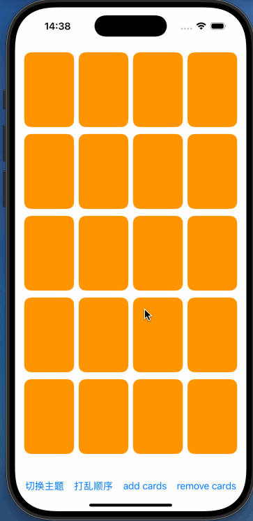
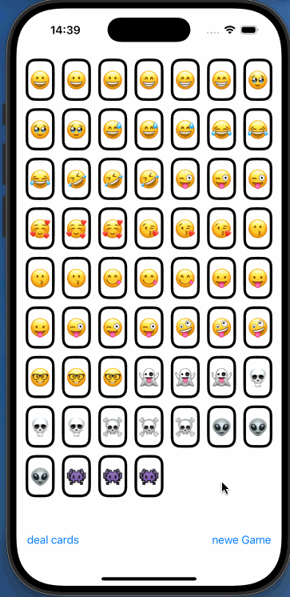
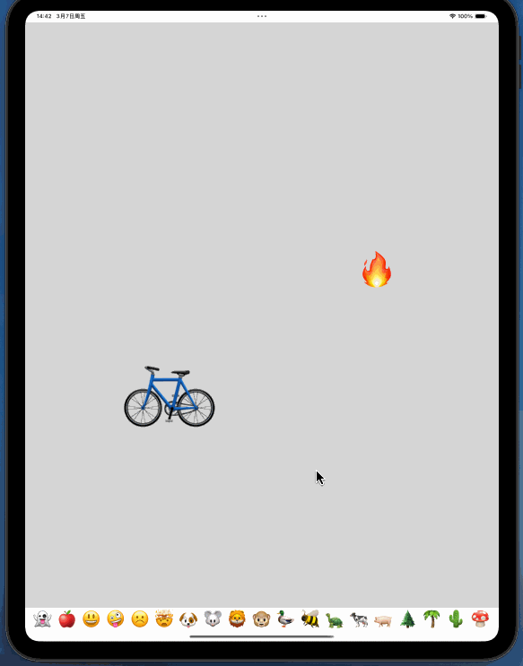
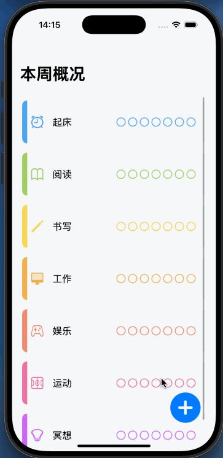

# SwiftLearning

> 本项目所参考资料如下：
>
> https://cs193p.stanford.edu/2023
>
> https://github.com/JangoCheung/swiftui-app-habits?tab=readme-ov-file

本项目主要为学习**CS193 developing Apps for iOS**而创建的项目。该项目分为以下几部分：

1. SwiftLearning。主要为学习学习swift、swiftUI时跟着视频所留下的code。
2. SwiftLearningAssignment。主要为课程中的作业
3. Projects。里面为使用Swift、SwiftUI实现的若干实践项目。

本课程和项目中所涉及的**知识点**有：

- Swift基本语法（集合、控制流、函数、闭包、枚举、类/结构体、属性、方法、协议、拓展、属性包装器）
- SwiftUI的基本使用（基础控件、布局控件、MVVM、手势、 动画、Drag and drop等 ）

其中，效果如下图所示：

                         

​             **Assignment02**                               **Assignment03**                            **Emoji_ArtApp**                                   **Project1**

 
